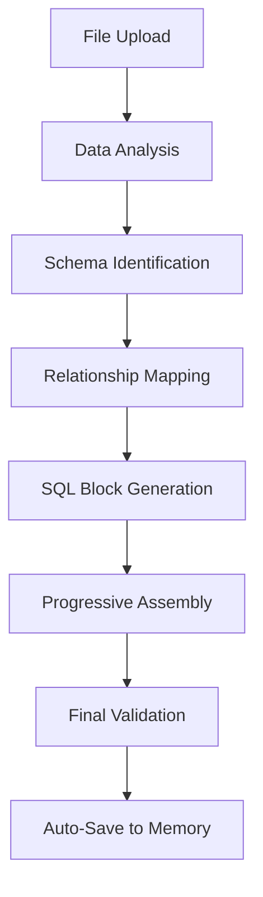

# AI-DE Backend API Documentation

## Overview

This document provides comprehensive documentation of all data structures and communication protocols between the AI-DE frontend and backend services. The system implements a streaming architecture for real-time SQL generation with progressive updates.

---

## 🔄 Communication Architecture

### Technology Stack

- **Frontend**: React 18.3.1 with Context API state management
- **Communication**: Server-Sent Events (SSE) for real-time streaming
- **Data Format**: JSON with structured payloads
- **State Sync**: Hashmap-based generation tracking

### Flow Overview

1. **User Input** → Frontend generates unique ID → Sends request to backend
2. **Backend Processing** → Streams progress updates via SSE → Frontend updates UI in real-time
3. **Completion** → Final SQL auto-saved to memory → Generation marked complete

---

## ⚠️ **IMPORTANT: File vs Content Transmission**

**The system sends CONTENT, not files.** Here's what actually gets transmitted:

### Excel Files 📊

- **NOT SENT**: Raw Excel binary files (.xlsx/.xls)
- **ACTUALLY SENT**: Parsed JSON data structure containing:
  - All sheet data as 2D arrays
  - Headers and row data separately structured
  - Sheet metadata (names, active sheet, row counts)
  - Processed using XLSX.js library client-side

### Code Files 📝

- **NOT SENT**: File handles or binary data
- **ACTUALLY SENT**: Plain text content as UTF-8 strings
- **Processing**: Content extracted client-side, then transmitted

### GitHub Files 🐙

- **NOT SENT**: File references or download URLs
- **ACTUALLY SENT**: Raw file content fetched via GitHub API
- **Processing**: Content downloaded client-side, then transmitted

**Why Content Instead of Files?**

- ✅ **Security**: No file upload vulnerabilities
- ✅ **Processing**: Content pre-processed and validated client-side
- ✅ **Efficiency**: Only relevant data transmitted
- ✅ **Privacy**: Files never leave user's environment until processed

---

## 📤 Frontend to Backend Data Structures

### 1. Chat Message Payload

When a user sends a message with attached files, the following structure is transmitted:

```javascript
{
  // Message Metadata
  "generation_id": "gen_1754817773341_7m3nqqc0n",
  "message": "Generate a semantic layer for customer data",
  "timestamp": "2025-08-10T09:23:06.844Z",
  "selected_llm": "claude-sonnet-3.5",

  // File Attachments - CONTENT ONLY, NO BINARY FILES
  "attachments": [
    {
      "fileType": "excel",
      "name": "CustomerMapping.xlsx",
      "path": "/path/to/CustomerMapping.xlsx",
      "source": "local", // or "github" or "cloud"
      "isGitHub": false,
      "isCloud": false,
      // CRITICAL: This contains parsed Excel data, NOT the raw file
      "excelData": {
        "fileName": "CustomerMapping.xlsx",
        "tabId": "tab_1754817773341",
        "sheetNames": ["Customer_Data", "Address_Data"],
        "sheetsData": {
          "Customer_Data": {
            "headers": ["customer_id", "customer_name", "email", "address_id"],
            "rows": [
              ["1", "John Doe", "john@example.com", "101"],
              ["2", "Jane Smith", "jane@example.com", "102"]
            ],
            "totalRows": 2
          },
          "Address_Data": {
            "headers": ["address_id", "address_line1", "city", "state"],
            "rows": [
              ["101", "123 Main St", "New York", "NY"],
              ["102", "456 Oak Ave", "Los Angeles", "CA"]
            ],
            "totalRows": 2
          }
        },
        "activeSheet": "Customer_Data"
      }
    },
    {
      "fileType": "code",
      "name": "schema.sql",
      "path": "/path/to/schema.sql",
      "source": "local",
      "isGitHub": false,
      "isCloud": false,
      // CRITICAL: This contains file content as text, NOT the file itself
      "content": "CREATE TABLE customers (\n  id INT PRIMARY KEY,\n  name VARCHAR(255)\n);"
    }
  ],

  // Context Information
  "workspace_context": {
    "open_files": ["CustomerMapping.xlsx", "schema.sql"],
    "available_files": 15,
    "excel_files_count": 3,
    "code_files_count": 7
  }
}
```

### 2. File Content Structures

#### Excel File Data

```javascript
{
  "type": "excel",
  "name": "CustomerMapping.xlsx",
  "content": {
    // IMPORTANT: This is NOT the raw Excel file
    // This is parsed content using XLSX.js library client-side
    "fileName": "CustomerMapping.xlsx",
    "tabId": "tab_1754817773341",
    "sheetNames": ["Customer_Data", "Address_Data", "Orders"],
    "sheetsData": {
      "Customer_Data": {
        "headers": ["customer_id", "customer_name", "email", "address_id"],
        "rows": [
          ["1", "John Doe", "john@example.com", "101"],
          ["2", "Jane Smith", "jane@example.com", "102"],
          ["3", "Bob Johnson", "bob@example.com", "103"]
        ],
        "totalRows": 3
      },
      "Address_Data": {
        "headers": ["address_id", "address_line1", "city", "state", "zip"],
        "rows": [
          ["101", "123 Main St", "New York", "NY", "10001"],
          ["102", "456 Oak Ave", "Los Angeles", "CA", "90210"],
          ["103", "789 Pine Rd", "Chicago", "IL", "60601"]
        ],
        "totalRows": 3
      },
      "Orders": {
        "headers": ["order_id", "customer_id", "order_date", "amount"],
        "rows": [
          ["1001", "1", "2025-01-15", "299.99"],
          ["1002", "2", "2025-02-20", "149.50"],
          ["1003", "1", "2025-03-10", "75.25"]
        ],
        "totalRows": 3
      }
    },
    "activeSheet": "Customer_Data"
  },
  "metadata": {
    "totalSheets": 3,
    "processedAt": "2025-08-10T09:15:00.000Z",
    "parsingLibrary": "xlsx.js",
    "clientSideProcessed": true
  }
}
```

#### Code File Data

```javascript
{
  "type": "code",
  "name": "schema.sql",
  "content": "CREATE TABLE customers (\n  id INT PRIMARY KEY,\n  name VARCHAR(255)\n);",
  "language": "sql",
  "metadata": {
    "size": 1024,
    "lastModified": "2025-08-10T09:10:00.000Z",
    "encoding": "utf-8"
  }
}
```

#### GitHub File Data

```javascript
{
  "type": "github",
  "name": "database_schema.sql",
  "path": "schemas/database_schema.sql",
  "source": "github",
  "isGitHub": true,
  "repository": {
    "owner": "company",
    "repo": "data-warehouse",
    "branch": "main",
    "commit_sha": "abc123def456"
  },
  "content": "-- GitHub file content here",
  "metadata": {
    "download_url": "https://raw.githubusercontent.com/company/data-warehouse/main/schemas/database_schema.sql",
    "size": 2048,
    "last_modified": "2025-08-09T15:30:00.000Z"
  }
}
```

### 3. User Context Data

```javascript
{
  "user_preferences": {
    "selected_llm": "claude-sonnet-3.5",
    "theme": "dark",
    "sql_dialect": "postgresql"
  },
  "session_context": {
    "session_id": "sess_1754817773341",
    "workspace_id": "ws_ai_de_pair",
    "active_tabs": ["CustomerMapping.xlsx", "generated-sql-gen_1754817773341.sql"],
    "memory_files_count": 3
  }
}
```

---

## 📥 Backend to Frontend Data Structures

### 1. SSE Event Types

#### Progress Update Event

```javascript
{
  "event": "progress_update",
  "data": {
    "generation_id": "gen_1754817773341_7m3nqqc0n",
    "stage": "analyzing",
    "stage_name": "Analyzing Data Structure",
    "progress_percentage": 45,
    "current_operation": "Processing Customer_Data sheet",
    "estimated_completion": "2025-08-10T09:25:00.000Z",
    "timestamp": "2025-08-10T09:23:30.000Z"
  }
}
```

#### SQL Block Update Event

```javascript
{
  "event": "sql_block_update",
  "data": {
    "generation_id": "gen_1754817773341_7m3nqqc0n",
    "block_type": "select_clause",
    "status": "completed",
    "sql_content": "SELECT \n  c.customer_id,\n  c.customer_name,\n  c.email",
    "order": 1,
    "timestamp": "2025-08-10T09:23:45.000Z"
  }
}
```

#### Generation Complete Event

```javascript
{
  "event": "generation_complete",
  "data": {
    "generation_id": "gen_1754817773341_7m3nqqc0n",
    "final_sql": "-- Complete SQL semantic layer here",
    "blocks_completed": 4,
    "total_time_seconds": 127,
    "quality_score": 0.92,
    "timestamp": "2025-08-10T09:25:00.000Z",
    "metadata": {
      "source_file": "CustomerMapping.xlsx",
      "tables_identified": ["customers", "addresses", "orders"],
      "joins_created": 2,
      "fields_mapped": 12
    }
  }
}
```

#### Error Event

```javascript
{
  "event": "generation_error",
  "data": {
    "generation_id": "gen_1754817773341_7m3nqqc0n",
    "error_type": "mapping_error",
    "error_message": "Unable to identify primary key in Customer_Data sheet",
    "error_code": "MAP_001",
    "timestamp": "2025-08-10T09:24:15.000Z",
    "recovery_suggestions": [
      "Ensure first row contains column headers",
      "Verify data types are consistent",
      "Check for primary key column"
    ]
  }
}
```

### 2. Generation State Synchronization

The backend maintains and syncs the following state structure:

```javascript
{
  "generation_id": "gen_1754817773341_7m3nqqc0n",
  "status": "in_progress", // pending|in_progress|completed|error|paused
  "current_stage": "generating-joins",
  "stages": {
    "parsing-file": {
      "status": "completed",
      "start_time": "2025-08-10T09:23:06.844Z",
      "end_time": "2025-08-10T09:23:20.000Z",
      "duration_ms": 13156
    },
    "analyzing": {
      "status": "completed",
      "start_time": "2025-08-10T09:23:20.000Z",
      "end_time": "2025-08-10T09:23:35.000Z",
      "duration_ms": 15000
    },
    "generating-joins": {
      "status": "in_progress",
      "start_time": "2025-08-10T09:23:35.000Z",
      "end_time": null,
      "duration_ms": null
    }
  },
  "sql_blocks": {
    "select_clause": {
      "status": "completed",
      "sql": "SELECT c.customer_id, c.customer_name, c.email",
      "order": 1,
      "timestamp": "2025-08-10T09:23:25.000Z"
    },
    "joins": {
      "status": "in_progress",
      "sql": "FROM customers c LEFT JOIN addresses a ON...",
      "order": 2,
      "timestamp": "2025-08-10T09:23:40.000Z"
    }
  },
  "metadata": {
    "source_file": "CustomerMapping.xlsx",
    "total_blocks": 4,
    "completed_blocks": 1,
    "progress_percentage": 25,
    "estimated_completion": "2025-08-10T09:26:00.000Z",
    "llm_model": "claude-sonnet-3.5"
  }
}
```

---

## 🔌 API Endpoints

### 1. Start Generation

```http
POST /api/v1/sql-generation/start
Content-Type: application/json

{
  "generation_id": "gen_1754817773341_7m3nqqc0n",
  "message": "Generate customer semantic layer",
  "attachments": [...],
  "llm_model": "claude-sonnet-3.5",
  "user_context": {...}
}
```

**Response:**

```json
{
  "success": true,
  "generation_id": "gen_1754817773341_7m3nqqc0n",
  "sse_endpoint": "/api/v1/sql-generation/stream/gen_1754817773341_7m3nqqc0n",
  "estimated_duration_seconds": 120
}
```

### 2. Stream Events

```http
GET /api/v1/sql-generation/stream/{generation_id}
Accept: text/event-stream
Cache-Control: no-cache
```

**Response Stream:**

```
event: progress_update
data: {"generation_id":"gen_1754817773341_7m3nqqc0n","stage":"analyzing",...}

event: sql_block_update
data: {"generation_id":"gen_1754817773341_7m3nqqc0n","block_type":"select_clause",...}

event: generation_complete
data: {"generation_id":"gen_1754817773341_7m3nqqc0n","final_sql":"...",...}
```

### 3. Get Generation Status

```http
GET /api/v1/sql-generation/status/{generation_id}
```

**Response:**

```json
{
  "generation_id": "gen_1754817773341_7m3nqqc0n",
  "status": "in_progress",
  "current_stage": "generating-joins",
  "progress_percentage": 45,
  "sql_blocks": {...},
  "metadata": {...}
}
```

### 4. Pause/Resume Generation

```http
POST /api/v1/sql-generation/{generation_id}/pause
POST /api/v1/sql-generation/{generation_id}/resume
```

### 5. Cancel Generation

```http
DELETE /api/v1/sql-generation/{generation_id}
```

---

## 📋 Data Processing Pipeline

### 1. File Processing Stages

#### Excel File Processing

1. **Client-Side Parsing** → Excel file parsed using XLSX.js in browser
2. **Data Extraction** → All sheets converted to JSON arrays with headers/rows separated
3. **Structure Validation** → Headers identified, data types inferred, row counts calculated
4. **Content Transmission** → Only parsed JSON structure sent to backend (NO binary data)
5. **Backend Analysis** → Receive structured data ready for semantic mapping

#### Code File Processing

1. **Client-Side Reading** → File content read as UTF-8 text in browser
2. **Content Validation** → Basic syntax checking and encoding validation
3. **Content Transmission** → Plain text content sent to backend
4. **Backend Analysis** → Language detection, syntax parsing, schema extraction

#### GitHub File Processing

1. **API Fetch** → Content downloaded via GitHub API client-side
2. **Content Processing** → Same as local file processing
3. **Content Transmission** → Processed content sent to backend
4. **Backend Analysis** → Standard content analysis pipeline

**Key Point: Files are NEVER uploaded as binary data. All processing happens client-side first.**

### 2. SQL Generation Pipeline



#### Stage Details:

1. **parsing-file** (15-20s): Extract and analyze file structure
2. **analyzing** (20-25s): Identify data types, relationships, patterns
3. **generating-joins** (25-30s): Create table join logic
4. **generating-select** (10-15s): Build SELECT clause with proper fields
5. **generating-filters** (10-15s): Add WHERE clauses and filters
6. **combining** (5-10s): Assemble final SQL
7. **complete** (instant): Mark generation complete, trigger auto-save

---

## 🔍 Frontend State Management

### AppStateContext Structure

```javascript
{
  // Core Application State
  openTabs: [
    {
      id: "tab_1754817773341",
      name: "CustomerMapping.xlsx",
      isActive: true,
      isDirty: false,
      isMemoryFile: false,
      fileId: "excel_1754817773341"
    }
  ],

  // Excel Files Data
  excelFiles: {
    "tab_1754817773341": {
      content: ArrayBuffer, // Binary Excel data
      sheetNames: ["Customer_Data", "Address_Data"],
      activeSheet: "Customer_Data",
      metadata: {...}
    }
  },

  // SQL Generation State
  sqlGeneration: {
    isActive: true,
    generationId: "gen_1754817773341_7m3nqqc0n",
    currentStage: "generating-joins",
    sqlContent: "SELECT c.customer_id...",
    stageHistory: [...],
    metadata: {
      sourceFile: "CustomerMapping.xlsx",
      startTime: "2025-08-10T09:23:06.844Z",
      estimatedCompletion: "2025-08-10T09:26:00.000Z"
    }
  },

  // Memory Files (Auto-saved SQL)
  memoryFiles: {
    "sql_gen_1754817773341": {
      name: "generated-sql-gen_1754817773341_7m3nqqc0n.sql",
      content: "-- Complete SQL semantic layer",
      type: "sql",
      createdAt: "2025-08-10T09:25:00.000Z",
      isGenerated: false
    }
  },

  // Chat State
  chatMessages: [
    {
      id: "msg_1754817773341",
      type: "user",
      content: "Generate customer semantic layer",
      timestamp: "2025-08-10T09:23:06.844Z",
      generationId: "gen_1754817773341_7m3nqqc0n",
      attachments: [...]
    }
  ]
}
```

---

## 🔐 Security Considerations

### File Access Security

- **Local Files**: Use File System Access API with user permission
- **Cloud Files**: OAuth 2.0 tokens for OneDrive, Google Drive, SharePoint
- **GitHub Files**: Personal Access Tokens for private repositories
- **Content Sanitization**: Validate file types, size limits, content filtering

### Data Privacy

- **No Persistent Storage**: Files processed in memory, not stored permanently
- **Session-based**: Data cleared on session end
- **Local Processing**: Excel parsing happens client-side when possible
- **Secure Transmission**: HTTPS for all API communication

### Authentication

```javascript
// Cloud Provider Authentication
{
  "provider": "onedrive",
  "access_token": "eyJ0eXAiOiJKV1QiLCJub25jZSI6...",
  "refresh_token": "M.R3_BAY.-CXaWl4HG2...",
  "expires_in": 3600,
  "scope": "https://graph.microsoft.com/Files.Read"
}
```

---

## 📊 Performance Optimizations

### Frontend Optimizations

- **Memoization**: React.memo, useMemo, useCallback for expensive operations
- **Lazy Loading**: Components and data loaded on demand
- **Excel Caching**: Parsed workbooks cached in memory
- **Debounced Updates**: Input and resize events debounced
- **Ref-based State**: Avoid unnecessary re-renders with useRef

### Backend Optimizations

- **Streaming**: Progressive SQL generation with real-time updates
- **Caching**: Results cached for similar mappings
- **Parallel Processing**: Multiple stages processed concurrently when possible
- **Resource Management**: Connection pooling, memory management

### Data Transfer Optimizations

- **Compression**: Gzip compression for API responses
- **Pagination**: Large datasets streamed in chunks
- **Delta Updates**: Only changed data transmitted
- **Binary Handling**: Efficient Excel file processing

---

## 🚀 Deployment Architecture

### Frontend Deployment

- **Static Hosting**: React build served from CDN
- **Environment Variables**: API endpoints, feature flags
- **Progressive Web App**: Offline capability, caching

### Backend Deployment

- **Microservices**: SQL generation service, file processing service
- **Load Balancing**: Multiple instances for scalability
- **Message Queue**: Redis/RabbitMQ for background processing
- **Database**: PostgreSQL for persistent data, Redis for caching

### Infrastructure

```yaml
# docker-compose.yml example
services:
  frontend:
    image: ai-de-frontend:latest
    ports: ['3000:80']

  backend:
    image: ai-de-backend:latest
    ports: ['8000:8000']
    environment:
      - DATABASE_URL=postgresql://...
      - REDIS_URL=redis://...

  redis:
    image: redis:7-alpine

  postgres:
    image: postgres:15
```

---

## 📈 Monitoring & Analytics

### Frontend Metrics

- **User Interactions**: File uploads, SQL generations initiated
- **Performance**: Page load times, component render times
- **Errors**: JavaScript errors, failed API calls
- **Usage Patterns**: Most used features, file types processed

### Backend Metrics

- **API Performance**: Response times, throughput
- **Generation Success Rate**: Completed vs failed generations
- **Resource Usage**: CPU, memory, database connections
- **Error Tracking**: Exception monitoring, error categorization

### Real-time Monitoring

```javascript
// Frontend Analytics Event
{
  "event": "sql_generation_started",
  "properties": {
    "generation_id": "gen_1754817773341_7m3nqqc0n",
    "file_type": "excel",
    "file_size_kb": 245,
    "llm_model": "claude-sonnet-3.5",
    "user_id": "anonymous_user_12345",
    "timestamp": "2025-08-10T09:23:06.844Z"
  }
}
```

---

## 🔧 Development Tools

### API Testing

```bash
# Start generation
curl -X POST http://localhost:8000/api/v1/sql-generation/start \
  -H "Content-Type: application/json" \
  -d '{"generation_id":"test_123","message":"Test generation",...}'

# Stream events
curl -N http://localhost:8000/api/v1/sql-generation/stream/test_123

# Check status
curl http://localhost:8000/api/v1/sql-generation/status/test_123
```

### Mock Data for Testing

```javascript
// Mock Excel Data
const mockExcelData = {
  sheets: {
    Customer_Data: [
      ['customer_id', 'customer_name', 'email', 'address_id'],
      ['1', 'John Doe', 'john@example.com', '101'],
      ['2', 'Jane Smith', 'jane@example.com', '102'],
    ],
  },
  activeSheet: 'Customer_Data',
  sheetNames: ['Customer_Data'],
  metadata: {
    totalRows: 3,
    totalColumns: 4,
  },
};
```

---

This documentation provides a complete reference for all data structures and communication protocols used in the AI-DE system. The streaming architecture enables real-time SQL generation with progressive updates, while the comprehensive state management ensures consistent user experience across all components.
