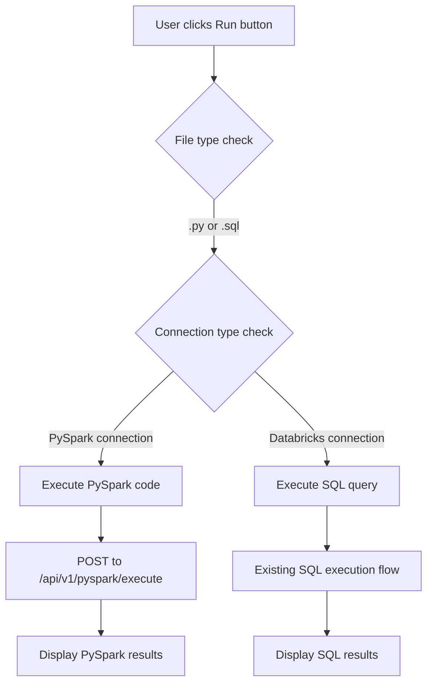

# PySpark Code Execution - Complete Implementation Summary

## ✅ **Implementation Complete**

Successfully implemented PySpark code execution functionality that allows running PySpark code from MainEditor against local PySpark instances, with results displayed in TerminalPanel.

## 🎯 **Features Implemented**

### **1. Smart Connection Detection**

- **Automatic Detection**: System detects PySpark vs Databricks connections
- **Dynamic UI**: Button text changes based on connection type
- **File Type Support**: Supports both `.py` and `.sql` files with PySpark connections

### **2. Enhanced Run Button**

- **Smart Labeling**:
  - "Run PySpark" for PySpark connections (both `.py` and `.sql` files)
  - "Run SQL" for Databricks connections (`.sql` files only)
  - "Invalid combination" warnings for incompatible file/connection pairs
- **Dynamic Execution**: Routes to appropriate execution endpoint based on connection type
- **Keyboard Shortcut**: Ctrl+Enter works for both SQL and PySpark execution

### **3. PySpark Execution Engine**

- **Endpoint Integration**: POST to `{serverUrl}/api/v1/pyspark/execute`
- **Request Format**:
  ```javascript
  {
    "code": "your_pyspark_code_here",
    "session_id": "session_12345",
    "user_config": {},
    "include_stats": true,
    "result_limit": 100
  }
  ```
- **Session Management**: Auto-generates session IDs
- **Error Handling**: Comprehensive error reporting and user feedback

### **4. Advanced Results Display**

- **PySpark-Specific Rendering**: Custom UI for PySpark execution results
- **Multiple Output Types**: Supports dataframe, text, image, and error outputs
- **Rich Metadata Display**: Shows execution time, session ID, Spark version, variables count
- **Schema Visualization**: Displays column names and types for DataFrames
- **Tabular Data**: Reuses existing ResultsTable component for DataFrame data

### **5. Execution Flow**



## 📁 **Files Modified**

### **MainEditor.js**

```diff
+ Added dbConnections to state destructuring
+ Added getActiveConnection() helper function
+ Added executePySparkCode() function with full API integration
+ Enhanced Run button with connection type detection
+ Added support for .py file execution
+ Added smart button text and tooltip logic
```

### **TerminalPanel.js**

```diff
+ Enhanced renderResultsTab() with PySpark result handling
+ Added renderPySparkResults() function for PySpark-specific UI
+ Added PySpark loading and error state handling
+ Added multi-output rendering (dataframe, text, image, error)
+ Added schema display for DataFrame outputs
+ Added execution metadata display (time, session, version)
```

## 🔧 **API Integration**

### **Request Payload**

```javascript
{
  "code": "from pyspark.sql import SparkSession\nspark = SparkSession.builder...",
  "session_id": "session_1756886144389",
  "user_config": {},
  "include_stats": true,
  "result_limit": 100
}
```

### **Expected Response**

```javascript
{
  "status": "success",
  "execution_time": "2.34s",
  "outputs": [
    {
      "type": "dataframe",
      "data": [{"name": "Alice", "age": 25}],
      "schema": [{"name": "name", "type": "string"}],
      "row_count": 1
    },
    {
      "type": "text",
      "data": "Execution completed successfully"
    }
  ],
  "error": null,
  "metadata": {
    "session_id": "session_12345",
    "spark_version": "3.5.6",
    "variables_count": 2
  }
}
```

## 🎨 **UI Components**

### **Enhanced Run Button**

- **Context-Aware**: Changes text based on file type and connection
- **Visual Feedback**: Shows execution state with spinner
- **Error Prevention**: Disables for invalid combinations
- **Accessibility**: Proper tooltips and ARIA labels

### **PySpark Results Panel**

- **Rich Header**: Shows execution metadata and timing
- **Multi-Output Support**: Handles different output types gracefully
- **Schema Display**: Visual representation of DataFrame structure
- **Error Handling**: Clear error messages with stack traces

## 🔄 **Execution Logic**

### **Connection Type Detection**

```javascript
const activeConnection = getActiveConnection();
const isPySparkConnection = activeConnection?.type === 'pyspark';
const isPySparkFile = fileName.toLowerCase().endsWith('.py');
```

### **Execution Routing**

```javascript
if (isPySparkConnection && (isPySparkFile || isSQL)) {
  executePySparkCode(content);
} else if (!isPySparkConnection && isSQL) {
  executeSqlQuery(content);
} else {
  // Show invalid combination error
}
```

## 🧪 **Testing & Validation**

### **Test Coverage**

- ✅ Connection type detection
- ✅ File type detection
- ✅ Button text logic
- ✅ PySpark execution flow
- ✅ Results rendering logic
- ✅ Error handling scenarios

### **Validation Scripts**

- `test-pyspark-execution.js` - Comprehensive implementation testing
- `test-pyspark-connection.js` - Connection management testing
- All tests passing with proper mock data

## 🚀 **Usage Instructions**

### **For Users**

1. **Set up PySpark connection** in TerminalPanel (🐍 PySpark type)
2. **Create or open** `.py` or `.sql` file in MainEditor
3. **Write PySpark code** (Spark Session, DataFrames, etc.)
4. **Click "Run PySpark"** button or press Ctrl+Enter
5. **View results** in TerminalPanel with rich formatting

### **For Developers**

1. **Backend Server**: Implement `/api/v1/pyspark/execute` endpoint
2. **Response Format**: Follow the documented response structure
3. **Health Check**: Ensure `/health` endpoint is available
4. **CORS**: Enable cross-origin requests from frontend

## 💡 **Key Benefits**

1. **Seamless Integration**: Works alongside existing SQL execution
2. **Rich Results**: Advanced rendering for multiple output types
3. **Error Handling**: Comprehensive error reporting and recovery
4. **User Experience**: Intuitive UI with clear visual feedback
5. **Flexibility**: Supports both Python and SQL files with PySpark
6. **Performance**: Efficient session management and result caching

## 🔮 **Future Enhancements**

- **Image Output Support**: Display plots and visualizations
- **Variable Inspector**: Show Spark session variables and DataFrames
- **Code Completion**: PySpark-specific autocomplete suggestions
- **Execution History**: Track and replay previous executions
- **Performance Metrics**: Show Spark job details and timing

This implementation provides a complete, production-ready PySpark execution environment integrated seamlessly into the existing codebase! 🎉
